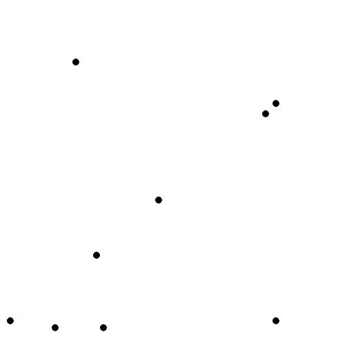
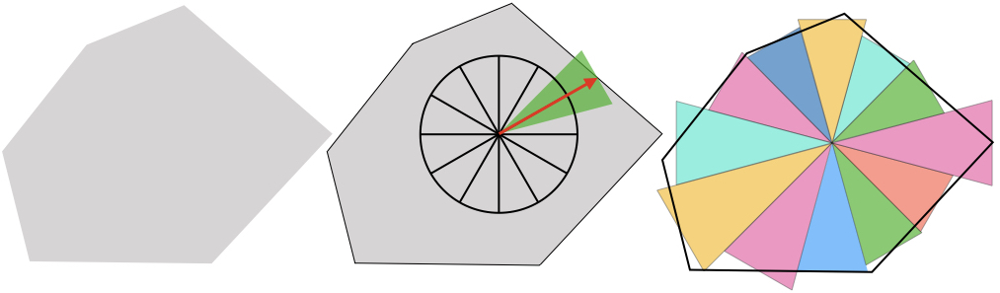

# bubble
3-Dimensional Voronoi Diagram Divided by Cones.

## Definition of Voronoi Diagram
In a metric space , the Voronoi diagram associated with a set of subset  is defined as the set of 
.

In our calculation, the distance function is Euclidean.

## Starting Point
Although bubbling is the elegant algorithm, the data structure and algorithm are complex and heavy.
However, contacted bubbles hinted starting point of an algorithm described later.

## Algorithm
Our approach accepts a partial reconstruction.
Maybe a novel approach. 
Please contact me if you know a similar one.

### Discretization and Data Structure
Voronoi cells are represented as a set of cones in our discretization.
The center of the bottom of each cone is adjusts to match the boundary of the cell.
In the discretization, overlaps and gaps of cones occur.
The property that the actual cell and the discretized cell coincide with each other as the number of divisions increases is the same as when using a cubic voxel.
Compressibility of information is higher when using a cone.

Our algorithm requires a grid to determine the direction of the cone.
The grid points are distributed almost uniformly on the spherical surface.
In addition, all of grid points are tethered to create a closed network, in order to speed up the calculation that determines the length of the vector extending from  to the bottom of each cone.
The grid point are managed as , which are same with angular coordinates in the spherical coordinate system.
The length between  and the center of bottom of cone depends , .

### Tesselation Procedure
To be detailed.

## Contribution
1. Fork it ( https://github.com/toyaku-phys/bubble/fork )
2. Create your feature branch (git checkout -b my-new-feature)
3. Commit your changes (git commit -am 'Add some feature')
4. Push to the branch (git push origin my-new-feature)
5. Create a new Pull Request to the bubble/master branch

Or write issue

## Versioning
We use [SemVer](http://semver.org/) for versioning. 
For the versions available, see the tags on this repository.

## Authors
* [**Hibiki Itoga**](https://github.com/misteltein) -Key programmer-
* [**yde**](https://github.com/master-yde) -Discussion partner-

## License
MIT-license
