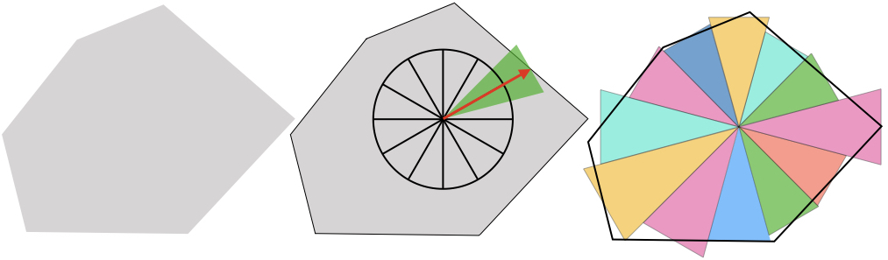
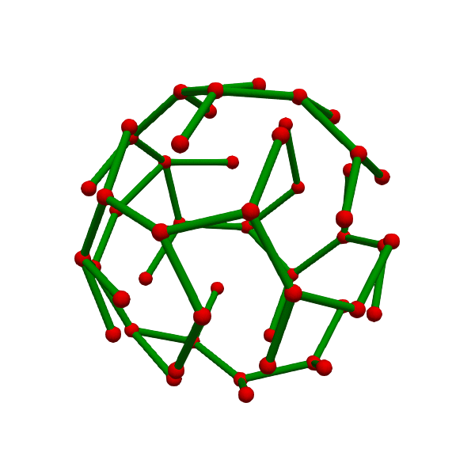
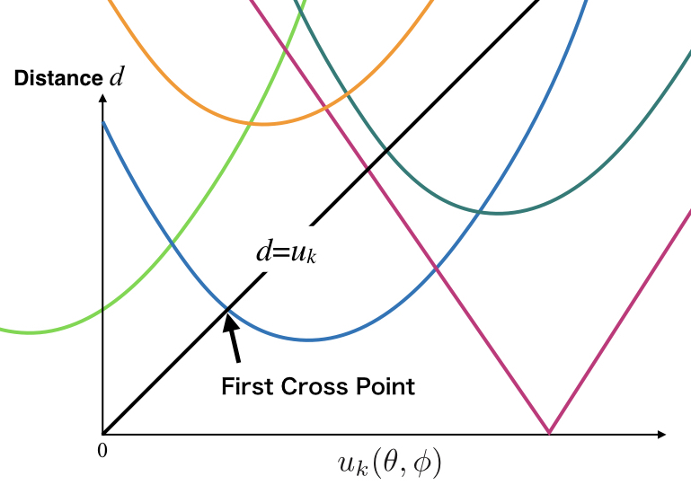

# bubble
3-Dimensional Voronoi Diagram Divided by Cones.

##Outline:
- Introduction
- Discretization for Voronoi cell
- Graph for Fast Boundary Fitting
- Tesselation Procedure
- Contribution
- Submodules
- Versioning
- Authors
- License

## General Definition of Voronoi Diagram
In a metric space , a Voronoi diagram for a set of subset  is defined as the set of .

## Starting Point
When regions expand from each point until contact with other regions,  it is equal to the Voronoi Diagram. This nature gives hints useful in calculating the Voronoi diagram. 
I thought that it would be possible to shorten the computation time by mimicking the style in which the boundary surfaces of each Voronoi cell are determined continuously from a point. 

### Discretization for Voronoi Cell
To discretize the Voronoi cell, we employed a set of cones which have different sizes. 
The tip of each cone is equal to Pk, and a center of the bottom face coincides with the boundary surface.
A solid angle at the tip of the cone is defined by a number of the cones in each Voronoi cell.
A mismatch such as a volume and surface area between actual Voronoi cell and discretized Voronoi cell becomes smaller when the number of cones is much.
This property is similar to a discretization using [a cubic voxel](https://en.wikipedia.org/wiki/Voxel).
In this discretization, each cone can be represented only by a unit direction vector r from the vertex to the center of the bottom face and a distance from the vertex to the center of the bottom face u.

### Graph for Fast Boundary Fitting

### Outline of Tesselation Procedure
#### 1. Find minimum 
- The minimum  is approximately equal to half of the distance to  closest to . Also, the direction  is a direction to .

#### 2. Solve the others 

- Reference values for a time-optimization:

    -  : u for the neighbor of 
    -  : the set of parameter beta of the distance function for each  and  direction
- Solve recursively
	1. Pop  from the stack
    2. If  is already solved, pop again
    	- When the stack size is zero, procedure is terminated
    3. Solve the distance functions (the initial parameter sets is set to  )
    4. Solve the first cross point of the distance functions (the inital cross point is set to  )
    5. Stack neighbor grid points of  using the network of grid points
    6. Stock the parameters of distance function as 
        - When  taken out from the stack, the stocked parameters are a parameters of distance function for neighbor of 

#### Remarks
1. If  is negative or infinite, the  is open
    
2. The parameters of the distance function are calculated using [the Levenberg–Marquardt algorithm](https://en.wikipedia.org/wiki/Levenberg–Marquardt_algorithm)

## Contribution
[Pull Request](https://github.com/toyaku-phys/bubble/pulls)

1. Fork it ( https://github.com/toyaku-phys/bubble/fork )
2. Create your feature branch (git checkout -b my-new-feature)
3. Commit your changes (git commit -am 'Add some feature')
4. Push to the branch (git push origin my-new-feature)
5. Create a new Pull Request to the bubble/master branch

[Issue](https://github.com/toyaku-phys/bubble/issues)

1. Write your new feature or bug report

## Submodules
- [misteltein/Levenberg-Marquardt](https://github.com/misteltein/Levenberg-Marquardt)
    - [toyaku-phys/eigen-git-mirror](https://github.com/toyaku-phys/eigen-git-mirror)
- [toyaku-phys/Chaperone](https://github.com/toyaku-phys/Chaperone)

## Versioning
We use [SemVer](http://semver.org/) for versioning. 
For the versions available, see the tags on this repository.

## Authors
* [**Hibiki Itoga**](https://github.com/misteltein) -Key programmer-
* [**yde**](https://github.com/master-yde) -Discussion partner-

## License
[MIT-license](LICENSE)
