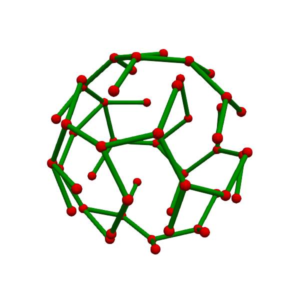

# bubble [unstable]
円錐型ボクセル表現した三次元ボロノイ図

## 概要

1. [序論](README_jp.md#一般的なボロノイ図の定義)
2. [ボロノイ細胞の離散化](README_jp.md#ボロノイ細胞の離散化)
3. [高速な境界面の算出のための最小全域木](README_jp.md#高速な境界面の算出のための最小全域木)
4. [距離函数の取り扱い](README_jp.md#距離函数の取り扱い)
5. [ボロノイ細胞を算出するためのアルゴリズム](README_jp.md#ボロノイ細胞を算出するためのアルゴリズム)
6. [寄与](README_jp.md#寄与)
7. [サブモジュールの一覧](README_jp.md#サブモジュールの一覧)
8. [バージョニング](README_jp.md#バージョニング)
9. [著者](README_jp.md#著者)
10. [ライセンス](README_jp.md#ライセンス)

## 一般的なボロノイ図の定義
距離空間において、部分集合についてのボロノイ図はボロノイ細胞の集合として定義される。

## 着想
散らばった点それぞれから領域を接触するまで拡張して生じた領域はボロノイ図に等しい。
この性質はボロノイ図を計算する際のヒントになった。
我々は、それぞれのボロノイ細胞を隔てる境界面は１点から連続的に決まってゆくという流れを模倣することで、
ボロノイ図の計算時間を短縮できるのではないかと考えた。

### ボロノイ細胞の離散化
ボロノイ細胞を離散化するために、我々は大きさの異なる円錐を利用する。
円錐の先端はPkに等しく、底面の中心点は境界面に含まれる。
また、円錐の先端の立体角はそれぞれのボロノイ細胞における円錐の数に応じて設定する。
実際のボロノイ細胞と離散化したボロノイ細胞の体積や表面積などの不一致は、円錐の数を多くするに従って減少する。
この性質は[立方体のボクセル](https://en.wikipedia.org/wiki/Voxel)を用いて表現した場合と同様である。
この離散化において、それぞれの円錐は、
先端から底面の中心に向かう単位方向ベクトル r と先端と底面の距離 u のみで表すことができる。

### 高速な境界面の算出のための最小全域木
円錐を表すための単位方向ベクトルを得るために、まず単位球面上に点を配置した。
そして均一な配置を得るために点の間に斥力を考慮し、焼きなまし法を用いた配置の最適化を行った。
その後、これらの点を頂点とする最小全域木を得た。
この木に沿って各頂点に対応するuの計算を行うことで、ボロノイ細胞の境界を算出する。このとき、前頂点の計算に使用した距離関数とuを次の計算の初期値として用いることで、反復計算の回数の削減を狙える。
この計算の起点はPkに最も近い母点に最も近い頂点である。
最小全域木を採用した理由は、再帰的なuの計算をする際に余計な呼び出しを引き起こすループ構造を含まないためである。

### 距離函数の取り扱い
ここでの距離函数は一般的な距離函数と異なり、ある直線 L= uD+Pkと点Piの距離をuの関数として表したものを指す。
これは、Pk=Piならばuに比例した形をとる。そして、PiがL上にない時、２次関数の形になる(Pが点であるとき)。
PiがL上にあるとき、１次関数を組み合わせたようなV字となる。

この性質のために、単純にパラメータセットとして距離函数を保持することはできない。
アルゴリズムの内容から、傾きが負である領域についての部分と、どこまで傾きが負であるのか分かるようにしておけば問題なく境界面を解くために利用できる。

### ボロノイ細胞を算出するためのアルゴリズム

#### 0. 変数の名前

- P: 母点の集合
- Pk: 算出するボロノイ細胞に対応する母点
- S: 頂点のインデックスのスタック
- U: uの配列
- D: 全ての母点とPkの距離函数の配列(具体的には函数のパラメータの配列)
- F: 真偽値の配列

#### 1. 離散化ボロノイ細胞を構成する円錐のうちもっとも小さい円錐を探す
もっとも小さい円錐は最小の  をもつ。
離散化が十分に細かく行われているならば、これの大きさはとそれにもっとも近い他の母点との距離の半分にほぼ等しいだろう。

#### 2. 木を辿ってすべてのを算出する
1. U を最大値で初期化, Fを偽で初期化
2. S に (theta0,phi0) に対応する頂点のインデックスをプッシュ
3. (theta0,phi0)についてDを計算([LM法](https://en.wikipedia.org/wiki/Levenberg–Marquardt_algorithm))
4. S からインデックスをポップ(i)
5. iに対応する頂点(theta,phi)を取得し、既存のDをもとに(theta,phi)に対応するDを算出
6. 母点に対応する距離函数と他の母点に対応する距離函数が交わるuのうち、正の範囲における最小のuとしてu(theta,phi)を算出
7. Fのi番目を真にする
8. 木をもとに、頂点iの隣接を参照したのち、その隣接頂点に対応するFの内容を参照し、それが偽であったのなら隣接頂点のインデックスをSにプッシュ
9. Sが空でなければ4に戻る

注意:

- u が最終的に最大値のままならばボロノイ細胞はその方向に開いている

## 寄与
[Pull Request](https://github.com/toyaku-phys/bubble/pulls)

1. フォーク( https://github.com/toyaku-phys/bubble/fork )
2. 新しい拡張のためのブランチを作成 (git checkout -b my-new-feature)
3. 変更をコミット (git commit -am 'Add some feature')
4. 作成したブランチにプッシュ (git push origin my-new-feature)
5. bubble/master ブランチにプルリクエスト

[Issue](https://github.com/toyaku-phys/bubble/issues)

1. 新規の拡張またはバグ報告をIssueに書き込む

## サブモジュールの一覧
- [misteltein/Levenberg-Marquardt](https://github.com/misteltein/Levenberg-Marquardt)
    - [toyaku-phys/eigen-git-mirror](https://github.com/toyaku-phys/eigen-git-mirror)
- [toyaku-phys/Chaperone](https://github.com/toyaku-phys/Chaperone)

## バージョニング
我々は[SemVer](http://semver.org/) に従ってバージョニングしている. 

## 著者
* [**Hibiki Itoga**](https://github.com/misteltein) -企画とプログラミング-
* [**yde**](https://github.com/master-yde) -議論相手-

## ライセンス
[MIT-ライセンス](LICENSE)
