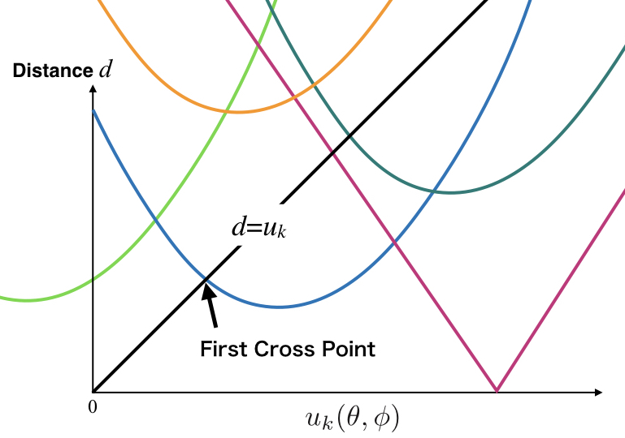

# bubble
円錐型ボクセル表現した三次元ボロノイ図

## 概要
- 序論
- ボロノイ細胞の離散化
- 高速な境界面の算出のための最小全域木
- Tesselation Procedure
- Contribution
- Submodules
- Versioning
- Authors
- License

## 一般的なボロノイ図の定義
距離空間において、部分集合についてのボロノイ図はボロノイ細胞の集合として定義される。

## 着想
散らばった点それぞれから領域を接触するまで拡張して生じた領域はボロノイ図に等しい。
この性質はボロノイ図を計算する際のヒントになった。
我々は、それぞれのボロノイ細胞を隔てる境界面は１点から連続的に決まってゆくという流れを模倣することで、
ボロノイ図の計算時間を短縮できるのではないかと考えた。

### ボロノイ細胞の離散化
ボロノイ細胞を離散化するために、我々は大きさの異なる円錐を利用する。
円錐の先端はPkに等しく、底面の中心点は境界面に含まれる。
また、円錐の先端の立体角はそれぞれのボロノイ細胞における円錐の数に応じて設定する。
実際のボロノイ細胞と離散化したボロノイ細胞の体積や表面積などの不一致は、円錐の数を多くするに従って減少する。
この性質は[立方体のボクセル](https://en.wikipedia.org/wiki/Voxel)を用いて表現した場合と同様である。
この離散化において、それぞれの円錐は、
先端から底面の中心に向かう単位方向ベクトル r と先端と底面の距離 u のみで表すことができる。

### 高速な境界面の算出のための最小全域木
円錐を表すための単位方向ベクトルを得るために、まず単位球面上に点を配置した。
そして均一な配置を得るために点の間に斥力を考慮し、焼きなまし法を用いた配置の最適化を行った。
その後、これらの点を頂点とする最小全域木を得た。
この木に沿って各頂点に対応するuの計算を行うことで、ボロノイ細胞の境界を算出する。このとき、前頂点の計算に使用した距離関数とuを次の計算の初期値として用いることで、反復計算の回数の削減を狙える。
この計算の起点はPkに最も近い母点に最も近い頂点である。
最小全域木を採用した理由は、再帰的なuの計算をする際に余計な呼び出しを引き起こすループ構造を含まないためである。

### Outline of Tesselation Procedure
#### 1. Find minimum 
- The minimum  is approximately equal to half of the distance to  closest to . Also, the direction  is a direction to .

#### 2. Solve the others 

- Reference values for a time-optimization:

    -  : u for the neighbor of 
    -  : the set of parameter beta of the distance function for each  and  direction
- Solve recursively
	1. Pop  from the stack
    2. If  is already solved, pop again
    	- When the stack size is zero, procedure is terminated
    3. Solve the distance functions (the initial parameter sets is set to  )
    4. Solve the first cross point of the distance functions (the inital cross point is set to  )
    5. Stack neighbor grid points of  using the network of grid points
    6. Stock the parameters of distance function as 
        - When  taken out from the stack, the stocked parameters are a parameters of distance function for neighbor of 

#### Remarks
1. If  is negative or infinite, the  is open
    
2. The parameters of the distance function are calculated using [the Levenberg–Marquardt algorithm](https://en.wikipedia.org/wiki/Levenberg–Marquardt_algorithm)

## Contribution
[Pull Request](https://github.com/toyaku-phys/bubble/pulls)

1. Fork it ( https://github.com/toyaku-phys/bubble/fork )
2. Create your feature branch (git checkout -b my-new-feature)
3. Commit your changes (git commit -am 'Add some feature')
4. Push to the branch (git push origin my-new-feature)
5. Create a new Pull Request to the bubble/master branch

[Issue](https://github.com/toyaku-phys/bubble/issues)

1. Write your new feature or bug report

## Submodules
- [misteltein/Levenberg-Marquardt](https://github.com/misteltein/Levenberg-Marquardt)
    - [toyaku-phys/eigen-git-mirror](https://github.com/toyaku-phys/eigen-git-mirror)
- [toyaku-phys/Chaperone](https://github.com/toyaku-phys/Chaperone)

## Versioning
We use [SemVer](http://semver.org/) for versioning. 
For the versions available, see the tags on this repository.

## Authors
* [**Hibiki Itoga**](https://github.com/misteltein) -Key programmer-
* [**yde**](https://github.com/master-yde) -Discussion partner-

## License
[MIT-license](LICENSE)
